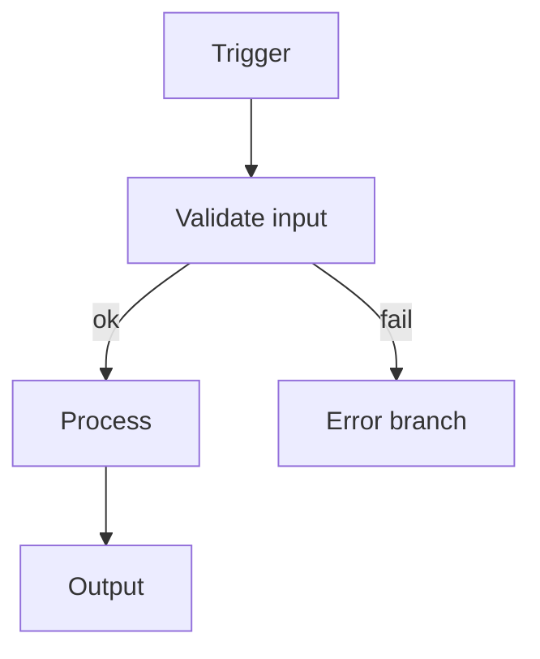

# n8n codebase documentation

#n8n #documentation #obsidian #standards #workflows

> **Companion:** [[N8N-CODING-PRINCIPLES]] — how we build workflows, custom nodes, and supporting code. This note defines how we document it. Document as you go; never treat docs as a post-merge chore.

---

## Purpose

Consistent documentation makes an n8n repository navigable for humans and useful for AI-assisted editing. These rules apply to **workflow JSON**, **community/custom node packages**, **shared libraries** consumed by Code nodes, and **operator runbooks**.

This guidance is **solution-agnostic** — it does not prescribe a particular integration or pipeline. Project-specific behaviour belongs in per-project vault notes and ADRs.

**Default stance:** if you add or change behaviour, you update the docs in the same change set.

---

## Workspace scope (mandatory)

All implementation — `lib/`, `tests/`, `scripts/`, `workflows/`, repo-root config, and vault notes — must be created and edited **only inside the repository that is open as the current Cursor workspace**. Do not write code or project artefacts to other paths on disk (alternate clones, sandbox folders, temp directories) unless the user explicitly names a different root in the task.

---

## Where documentation lives (this repo)

| Location | Use for |
|----------|---------|
| `README.md` (repo root) | Project summary, n8n version target, install/build, test commands, import/deploy steps, pointer to vault |
| `docs/vault/` | **Obsidian vault** — architecture, workflow specs, node/credential catalog, ADRs, these guidance notes |
| Workflow **Sticky Notes** | In-canvas summary (must match vault workflow note) |
| **Node display names** | Human-readable intent (`Normalize payload`, not `Set3`) |
| **INodeType / ICredentialType descriptions** | User-facing text in the n8n editor for custom nodes |
| `lib/` JSDoc or package `*.ts` doc comments | Testable logic contract |
| `CHANGELOG.md` | Workflow or package behaviour changes (optional) |

**Obsidian:** open the repo's `docs/vault/` folder as a vault.

---

## Vault layout (`docs/vault/`)

Guidance notes sit at the **vault root**. Project notes go in subfolders:

```
docs/vault/
├── N8N-CODING-PRINCIPLES.md         ← build standards (this repo)
├── N8N-CODEBASE-DOCUMENTATION.md    ← this note
├── 00-MOC-<project>.md              ← per-project map of content
├── architecture/
│   ├── overview.md
│   ├── repo-layout.md
│   ├── module-map.md
│   ├── integrations.md              ← external systems (sandbox vs prod)
├── programs/                        ← per-program overview (complaints, daily-checks, daily-ops)
├── integrations/
│   └── catalog.md                   ← external systems + sandbox substitutes
├── governance/
├── schemas/
├── prompts/
│   ├── <workflow-name>.md           ← one note per exported workflow JSON
│   └── data-flow.md
├── nodes/
│   ├── catalog.md                   ← built-in + custom nodes in use
│   └── <custom-node>.md             ← per custom node (if applicable)
├── credentials/
│   └── catalog.md                   ← credential types; sandbox rules
├── packages/
│   └── <package-name>.md            ← community node package notes
├── lib/
│   └── public-api.md                ← shared helpers (if lib/ exists)
├── guides/
│   ├── getting-started.md
│   └── import-and-test.md
├── testing/
│   └── strategy.md
```

**MOC note:** `00-MOC-<project>.md` is the project index. Every major note should be linked from the MOC or from a note the MOC links to. No orphan pages.

**Do not** create a second vault (e.g. `obsidian/vault/`). This repo has one vault: `docs/vault/`.

### fixtures/ and sandbox-services/

| Path | Expectation |
|------|-------------|
| `fixtures/<program>/` | Committed sample inputs (eml, json) for tests and demos |
| `sandbox-services/` | Local mock HTTP (Express); documented in [[integrations/catalog]] |
| `prompts/<program>/` | Versioned templates; indexed in `docs/vault/prompts/` |


## Obsidian formatting conventions

### Wikilinks

```markdown
See [[workflows/order-sync]] for the main automation.
See [[nodes/catalog#HTTP Request]] for outbound call policy.
Standards: [[N8N-CODING-PRINCIPLES]]
```

Vault-root notes: `[[N8N-CODING-PRINCIPLES]]`, `[[guides/getting-started]]`.

### Headings

- One `#` title per note.
- Stable `##` / `###` text for fragment links.

### Tags

```markdown
#n8n #workflow #community-node #sandbox
```

Prefer wikilinks for structure; tags for cross-cutting themes.

### Code blocks

Fence with language id (`json`, `javascript`, `typescript`, `powershell`, `mermaid`).

### Workflow diagrams

Use Mermaid for topology and error paths:

````markdown

````

### Callouts

```markdown
> [!warning] Credentials
> Credential *types* are documented; credential *values* never appear in git or vault examples.
```

---

## What to document (and when)

| Event | Update |
|-------|--------|
| New or changed workflow JSON | [[workflows/<name>]] + canvas stickies + [[workflows/data-flow]] if topology changes |
| New custom node or credential type | [[nodes/<name>]] or [[packages/<name>]] + [[nodes/catalog]] |
| New built-in node usage pattern | [[nodes/catalog]] (why this node, not alternatives) |
| New credential type required | [[credentials/catalog]] — name, purpose, sandbox substitute |
| Business rule change | [[lib/public-api]] and/or workflow note + ADR if non-obvious |
| n8n version bump | README + [[architecture/overview]] + re-import test notes |
| Error-handling change | Workflow note error branch + [[N8N-CODING-PRINCIPLES#Error handling]] |
| Script / entrypoint change | [[guides/getting-started]] + README |

**Rule:** documentation is part of definition of done, same as tests. See [[N8N-CODING-PRINCIPLES#Testing]].

---

## Document types

### 1. MOC

`00-MOC-<project>.md` — one-paragraph project summary + links to workflows, packages, credentials policy, testing, architecture.

### 2. Architecture overview

Answer:

- What artefacts does this repo own (workflows only, custom nodes, both)?
- Target **n8n version** (pin in README and vault).
- How do workflows relate (parent/sub-workflow, error workflow)?
- Where does business logic live (expressions, Code node, `lib/`, custom node package)?
- Sandbox vs production boundaries ([[architecture/integrations]]).

Link [[architecture/repo-layout]] and [[architecture/module-map]].

### 3. Repo layout

Document the actual tree for **this** project (workflows repo, node package repo, or monorepo). See [[N8N-CODING-PRINCIPLES#Project structure]] for patterns — do not invent paths not used in the repo.

### 4. Workflow notes (one per JSON)

Each exported `workflows/<name>.json` gets `docs/vault/workflows/<name>.md`:

| Section | Content |
|---------|---------|
| **Purpose** | One sentence |
| **Trigger** | Node type, mode (webhook, poll, manual, schedule), activation requirements |
| **n8n version** | Minimum version if using version-specific nodes |
| **Inputs** | Expected item shape (`json` fields, binary if any) |
| **Outputs** | What downstream systems or workflows receive |
| **Node chain** | Ordered list matching **display names** on canvas |
| **Expressions** | Non-obvious `{{ }}` patterns worth calling out |
| **Error paths** | Error Trigger workflow, IF branch, or `onError` behaviour — no silent drops |
| **Credentials** | Types used; reference [[credentials/catalog]] — no values |
| **Idempotency** | Safe to re-run? duplicate handling? |
| **Import / activate** | Steps for operator |
| **Manual test checklist** | Concrete steps to verify in editor |

### 5. Nodes catalog

[[nodes/catalog]] — table of node types used in this repo:

| Node | Role | Why not Code? / Why not other node? |
|------|------|-------------------------------------|
| Set | Field mapping | Declarative vs custom script |
| IF / Switch | Branching | Prefer over nested Code |
| Code | Thin adapter to `lib/` | Only when built-ins insufficient |

For custom nodes: link to [[nodes/<name>]] or [[packages/<name>]].

### 6. Credentials catalog

[[credentials/catalog]]:

- Credential **type** name (e.g. `httpHeaderAuth`)
- Purpose in this project
- Sandbox approach (mock, httpbin, local file, empty stub — **no real secrets**)
- Which workflows reference it
- Confirm: **never committed** — `.gitignore` for `credentials/` exports and `.n8n/` runtime

### 7. Custom node / package notes

For `packages/n8n-nodes-*` or similar:

- Package name and `package.json` `n8n` block
- Nodes and credentials exported
- Build command (`npm run build`)
- Install into local n8n instance for dev
- Link to n8n docs: INodeType, ICredentialType, `NodeConnectionTypes`

### 8. Lib public API

If the repo has `lib/` for Code node helpers:

- Each exported function: purpose, params, return, errors
- Link to test file
- Which workflow(s) consume it

### 9. ADRs

When a choice is not obvious (Code vs Set, sub-workflow split, error workflow vs inline branch, custom node vs lib):

```markdown
# ADR 001: Use sub-workflow for shared validation

## Status
Accepted

## Context
Three workflows share the same input validation.

## Decision
Extract validation to `workflows/_shared-validate.json`; call via Execute Workflow.

## Consequences
- Single validation note in [[workflows/_shared-validate]]
- Parent workflows stay smaller; version pin documented
```

---

## Inline documentation (n8n artefacts)

### Workflow canvas

| Item | Required |
|------|----------|
| Workflow name | Descriptive, stable (`CRM — contact upsert`) |
| Node display names | Verb-noun intent |
| Sticky Note (top) | Purpose, vault link `[[workflows/<name>]]`, trigger summary |
| Disabled nodes | Remove or document why disabled in workflow note |
| TODO stickies | Forbidden on main branch — track in vault or issue |

### Custom nodes (`INodeType`)

| Field | Required |
|-------|----------|
| `displayName` / `description` | Clear user-facing text |
| `properties` | `description` on non-obvious parameters |
| `subtitle` / `defaults.name` | Distinguish duplicate instances |
| Resource docs URL | Link to vault note when internal |

### Code nodes

- **Thin** — delegate to `lib/` or custom node package; see [[N8N-CODING-PRINCIPLES#Code nodes]].
- Header comment: vault link + expected `$input` item shape only if non-obvious.

### JSDoc / TSDoc on shared logic

```typescript
/**
 * Normalize webhook payload to internal order shape.
 * @throws {Error} When required field `orderId` is missing.
 */
export function normalizeOrder(payload: unknown): Order { ... }
```

---

## README minimum bar

Root `README.md` must include:

1. **Project name and one-line description**
2. **Target n8n version** (and Node.js for packages)
3. **Repo type** — workflows / custom nodes / both
4. **Setup** — use `scripts/run.ps1` or documented `npm install` / build (see [[guides/getting-started]])
5. **Run tests** — exact command via entrypoint
6. **Import workflows** — path glob, activate notes, credential setup (types only)
7. **Layout** — pointer to `workflows/`, `packages/`, `lib/`, `docs/vault/`
8. **Documentation** — open `docs/vault`; start at project MOC
9. **Standards** — [[N8N-CODING-PRINCIPLES]] and this note

---

## Documentation quality checklist

Before commit:

- [ ] Workflow JSON matches workflow vault note (nodes, branches, credentials **types**)
- [ ] Sticky notes and display names updated on canvas
- [ ] [[credentials/catalog]] lists types only — no secret values anywhere
- [ ] Custom node descriptions match `*.node.ts` properties
- [ ] [[lib/public-api]] matches exports (if `lib/` exists)
- [ ] README n8n version and commands still accurate
- [ ] Wikilinks resolve
- [ ] Examples use sandbox-safe endpoints and fake data
- [ ] Tests pass via entrypoint

---

## Anti-patterns

| Do not | Do instead |
|--------|------------|
| "Docs PR later" | Same change set as workflow/code |
| Second vault at `obsidian/vault/` | Use `docs/vault/` only |
| Credential values in JSON or vault | Credential types in catalog; values in n8n credential store only |
| Undocumented workflow on canvas | Matching `workflows/<name>.md` |
| Mystery node names (`IF2`, `Code3`) | Intent display names |
| Logic only in Code node | Built-in nodes first; then `lib/` or custom node |
| Export workflow with embedded secrets | Strip before commit; document required credentials |
| Stale node catalog | Update when adding/removing node types |

---

## AI-assisted editing guidance

When using Cursor:

1. Read [[N8N-CODING-PRINCIPLES]] and this note before implementing.
2. Work **only in the open workspace repository** — see [[#Workspace scope (mandatory)]].
3. Update vault notes under `docs/vault/` in the **same session** as workflow/package changes.
4. Add wikilinks when creating notes.
5. Never document nodes, credentials, or routes that do not exist in code/JSON.
6. Never invent or embed production credentials, tokens, or connection strings.

---

## Related

- [[N8N-CODING-PRINCIPLES]] — workflow design, nodes, testing, fail-fast
- [[guides/getting-started]] — bootstrap, build, entrypoint
- [[guides/import-and-test]] — operator checklist (create per project)
- [[testing/strategy]] — per-project (create when building)
- [[architecture/overview]] — per-project (create when building)
