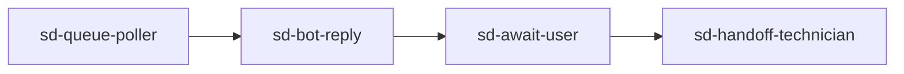

# Workflow testing guide

#n8n #guide #testing #workflow

How to execute each workflow in n8n and verify it **actually worked** (not just green execution).

Prerequisites: [[guides/getting-started]], [[workflows/00-workflows-index]]

## Setup (once per session)

```powershell
# Terminal 1 — optional, for real HTTP ticket/CRM posts
cd C:\repos\sandbox-n8n
.\scripts\run.ps1 mock-api

# Terminal 2
.\scripts\run.ps1 n8n
```

First time: `.\scripts\run.ps1 import-workflows`

Confirm env in n8n process (or set in n8n settings):

- `N8N_REPO_ROOT=C:/repos/sandbox-n8n`
- `N8N_DATA_ROOT=C:/sandbox-dir/sandbox-n8n`

Data folders: see [[guides/getting-started#Data root (one-time)]].

## How to read n8n execution output

1. Open workflow → **Execute workflow**
2. Click **Run lib** (or named Code node) → **Output** tab
3. Check JSON fields listed in each workflow doc **Success criteria**
4. On disk, verify files under `C:\sandbox-dir\sandbox-n8n\` (not the git repo)

Green checkmark in n8n only means no thrown error — always check output JSON **and** side-effect files.

## Verify on disk (PowerShell)

```powershell
$data = 'C:\sandbox-dir\sandbox-n8n'
Get-ChildItem $data\_runtime -ErrorAction SilentlyContinue
Get-ChildItem $data\outbound\sent -ErrorAction SilentlyContinue
Get-ChildItem $data\outbound\servicedesk\chat -ErrorAction SilentlyContinue
Get-ChildItem $data\outbound\teams -ErrorAction SilentlyContinue
Get-ChildItem $data\cursor-requests -Recurse -ErrorAction SilentlyContinue
```

## Program walkthroughs

### Complaints (5 workflows)

| Step | Workflow | What “worked” looks like |
|------|----------|--------------------------|
| 1 | [[workflows/complaints/complaints-classify]] | Output `classification.category` = `dsar` |
| 2 | [[workflows/complaints/complaints-route]] | Output `ticket_ref` starts with `tkt_sim_` or `TKT-` (with mock-api) |
| 3 | [[workflows/complaints/complaints-notify-customer]] | New `.eml` or notification file in `outbound/sent/` |
| 4 | [[workflows/complaints/complaints-intake]] | Full record; `_runtime/complaints-db.json` has complaint |
| 5 | [[workflows/complaints/complaints-monitor-replies]] | Output `status` may be `escalated` |

**Fast path without n8n:** `.\scripts\run.ps1 smoke-complaints`

### Service desk (7 workflows)

Recommended sequence:



| Workflow | Disk / output proof |
|----------|---------------------|
| [[workflows/servicedesk/sd-intake]] | Valid ticket JSON with `lifecycle_events` |
| [[workflows/servicedesk/sd-classify-triage]] | `kb_matches.length > 0`, `triage.queue` set |
| [[workflows/servicedesk/sd-bot-reply]] | File in `outbound/servicedesk/chat/`; `status: awaiting_user` |
| [[workflows/servicedesk/sd-await-user]] | User turn in `conversation` array |
| [[workflows/servicedesk/sd-handoff-technician]] | `status: with_technician`, `assignment.handoff_at` set |
| [[workflows/servicedesk/sd-queue-poller]] | `_runtime/servicedesk-db.json` updated |
| [[workflows/servicedesk/sd-existing-ticket-refresh]] | Refreshed `kb_matches` on awaiting ticket |

**Fast path:** `.\scripts\run.ps1 smoke-servicedesk`

### Daily checks (3 workflows)

| Workflow | Proof |
|----------|-------|
| [[workflows/daily-checks/dc-schedule-run]] | `rows[0].id` = `exc_001` |
| [[workflows/daily-checks/dc-triage-exception]] | `ticket.ticket_ref` in output |
| [[workflows/daily-checks/dc-cursor-bundle]] | Folder under `cursor-requests/` with `pr-summary.md` |

**Fast path:** `.\scripts\run.ps1 smoke-daily-checks`

### Daily ops (2 workflows)

| Workflow | Proof |
|----------|-------|
| [[workflows/daily-ops/do-schedule-run]] | Row `ops_001` in output |
| [[workflows/daily-ops/do-route-owners]] | `outbound/teams/ops_002-teams.json` (or similar) exists |

**Fast path:** `.\scripts\run.ps1 smoke-daily-ops`

### Shared sub-workflows (5)

Test in isolation before chaining in canvas:

| Workflow | Proof |
|----------|-------|
| [[workflows/_shared/create-ticket]] | `ticket_ref` in output |
| [[workflows/_shared/kb-search]] | `items` array with VPN doc |
| [[workflows/_shared/call-ai-sim]] | DSAR classification |
| [[workflows/_shared/send-notification]] | File in `outbound/sent/` |
| [[workflows/_shared/log-lifecycle-event]] | Log JSON returned |

## Mock API enabled vs offline

| Mode | How | Ticket refs |
|------|-----|-------------|
| Offline | mock-api not running | `tkt_sim_*`, `crm_sim_*` |
| HTTP | mock-api + `N8N_MOCK_API_ENABLED=1` | Real `TKT-*` in http://localhost:3099/tickets |

Check mock-api: `Invoke-RestMethod http://localhost:3099/health`

## Automated regression

```powershell
.\scripts\run.ps1 test   # 83 unit/smoke tests — no n8n
.\scripts\run.ps1 demo   # all program smokes
```

## Related

- [[workflows/00-workflows-index]]
- [[testing/strategy]]
