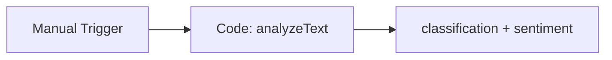

# Shared Call AI Sim

#n8n #workflow #shared

## File

`workflows/_shared/call-ai-sim.json`

## Purpose

Run deterministic AI classifier on sample text.

## Trigger

Manual Trigger (POC). Production would use Schedule / file watch / webhook per program.

## Flow

## Lib calls

`analyzeText`

## Success criteria

Output `classification.category` is `dsar` for subject-access sample text.

All writes stay under `N8N_DATA_ROOT`. See [[governance/sandbox-boundaries]].

## Related

- [[workflows/00-workflows-index]]
- [[workflows/data-flow]]
