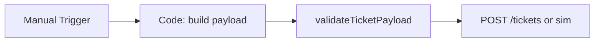

# Shared Create Ticket

#n8n #workflow #shared

## File

`workflows/_shared/create-ticket.json`

## Purpose

Validate and POST a unified ticket payload to mock API (or simulate offline).

## Trigger

Manual Trigger (POC). Production would use Schedule / file watch / webhook per program.

## Flow

## Lib calls

`createTicketPayload`, `validateTicketPayload`, `createTicket`

## Success criteria

Output JSON has `ticket_ref` (real from mock-api or `tkt_sim_shared` offline).

All writes stay under `N8N_DATA_ROOT`. See [[governance/sandbox-boundaries]].

## CLI equivalent

`Requires mock-api for real HTTP: `run.ps1 mock-api` then set `N8N_MOCK_API_ENABLED=1` in n8n env.`

## Related

- [[workflows/00-workflows-index]]
- [[workflows/data-flow]]
