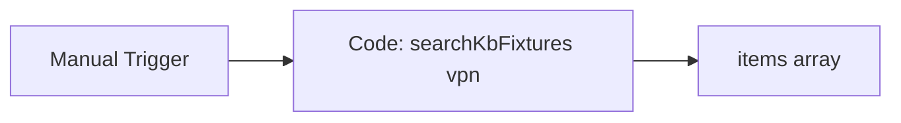

# Shared KB Search

#n8n #workflow #shared

## File

`workflows/_shared/kb-search.json`

## Purpose

Search fixture KB articles for a query term.

## Trigger

Manual Trigger (POC). Production would use Schedule / file watch / webhook per program.

## Flow

## Lib calls

`searchKbFixtures`

## Success criteria

Output `items` includes VPN troubleshooting doc with score > 0.

All writes stay under `N8N_DATA_ROOT`. See [[governance/sandbox-boundaries]].

## Related

- [[workflows/00-workflows-index]]
- [[workflows/data-flow]]
