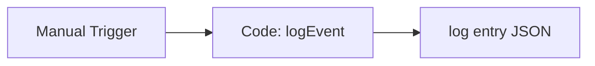

# Shared Log Lifecycle Event

#n8n #workflow #shared

## File

`workflows/_shared/log-lifecycle-event.json`

## Purpose

Emit a structured log event via lib logging helper.

## Trigger

Manual Trigger (POC). Production would use Schedule / file watch / webhook per program.

## Flow

## Lib calls

`logEvent`

## Success criteria

Output JSON contains event metadata with `ok: true` in detail.

All writes stay under `N8N_DATA_ROOT`. See [[governance/sandbox-boundaries]].

## Related

- [[workflows/00-workflows-index]]
- [[workflows/data-flow]]
