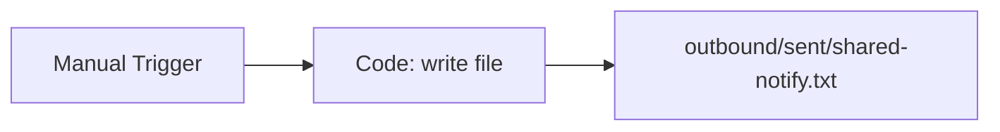

# Shared Send Notification

#n8n #workflow #shared

## File

`workflows/_shared/send-notification.json`

## Purpose

Write a notification sim file under outbound/sent/.

## Trigger

Manual Trigger (POC). Production would use Schedule / file watch / webhook per program.

## Flow

## Lib calls

fs write under `DATA_ROOT/outbound/sent/`

## Success criteria

File exists at path in output JSON; stays under `N8N_DATA_ROOT`.

All writes stay under `N8N_DATA_ROOT`. See [[governance/sandbox-boundaries]].

## Related

- [[workflows/00-workflows-index]]
- [[workflows/data-flow]]
