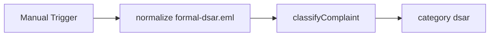

# Complaints Classify

#n8n #workflow #complaints

## File

`workflows/complaints/complaints-classify.json`

## Purpose

Normalize and classify formal-dsar fixture only.

## Trigger

Manual Trigger (POC). Production would use Schedule / file watch / webhook per program.

## Flow

## Lib calls

`normalizeInboundArtifact`, `classifyComplaint`

## Success criteria

Output `classification.category` is `dsar`; `requested_actions` includes `DSAR`.

All writes stay under `N8N_DATA_ROOT`. See [[governance/sandbox-boundaries]].

## Related

- [[workflows/00-workflows-index]]
- [[workflows/data-flow]]
