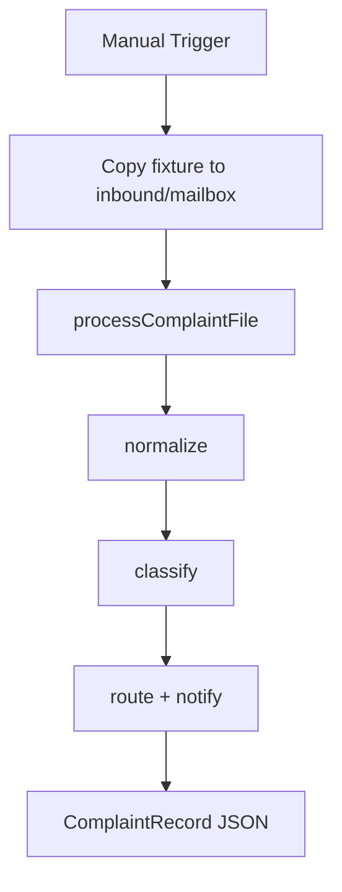

# Complaints Intake

#n8n #workflow #complaints

## File

`workflows/complaints/complaints-intake.json`

## Purpose

Full complaints pipeline: copy angry-support fixture → normalize → classify → route → notify.

## Trigger

Manual Trigger (POC). Production would use Schedule / file watch / webhook per program.

## Flow

## Lib calls

`processComplaintFile`, `FileComplaintStore`

## Success criteria

`classification.category` present; `ticket_ref` set; `_runtime/complaints-db.json` updated; email sim in `outbound/sent/`.

All writes stay under `N8N_DATA_ROOT`. See [[governance/sandbox-boundaries]].

## CLI equivalent

``.\scripts\run.ps1 smoke-complaints` or `process-complaints``

## Related

- [[workflows/00-workflows-index]]
- [[workflows/data-flow]]
