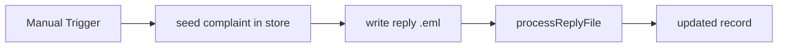

# Complaints Monitor Replies

#n8n #workflow #complaints

## File

`workflows/complaints/complaints-monitor-replies.json`

## Purpose

Link inbound reply .eml to complaint by Thread-ID.

## Trigger

Manual Trigger (POC). Production would use Schedule / file watch / webhook per program.

## Flow

## Lib calls

`processReplyFile`, `FileComplaintStore`

## Success criteria

Output record updated; reply linked via `thread_id`; may escalate status.

All writes stay under `N8N_DATA_ROOT`. See [[governance/sandbox-boundaries]].

## Related

- [[workflows/00-workflows-index]]
- [[workflows/data-flow]]
