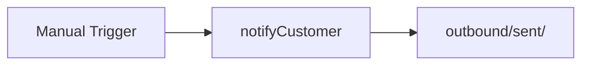

# Complaints Notify Customer

#n8n #workflow #complaints

## File

`workflows/complaints/complaints-notify-customer.json`

## Purpose

Render and write customer notification email sim.

## Trigger

Manual Trigger (POC). Production would use Schedule / file watch / webhook per program.

## Flow

## Lib calls

`notifyCustomer`

## Success criteria

New file under `outbound/sent/`; record status reflects notification.

All writes stay under `N8N_DATA_ROOT`. See [[governance/sandbox-boundaries]].

## Related

- [[workflows/00-workflows-index]]
- [[workflows/data-flow]]
