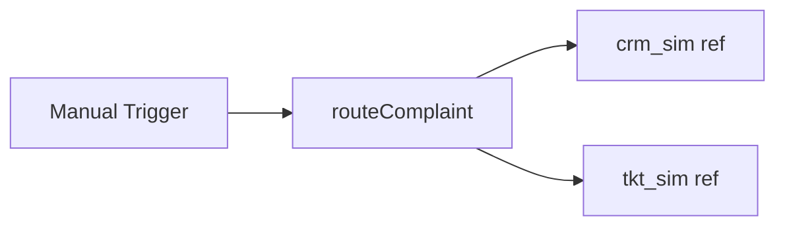

# Complaints Route

#n8n #workflow #complaints

## File

`workflows/complaints/complaints-route.json`

## Purpose

Route a compliance complaint to CRM sim + unified ticket (offline by default).

## Trigger

Manual Trigger (POC). Production would use Schedule / file watch / webhook per program.

## Flow

## Lib calls

`routeComplaint` with `skipHttp: true`

## Success criteria

Output has `ticket_ref` and lifecycle event `ticket_created`; `source_program` would be complaints on real API post.

All writes stay under `N8N_DATA_ROOT`. See [[governance/sandbox-boundaries]].

## Related

- [[workflows/00-workflows-index]]
- [[workflows/data-flow]]
