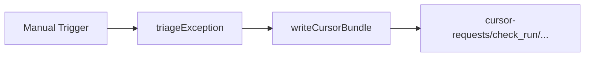

# DC Cursor Bundle

#n8n #workflow #daily-checks

## File

`workflows/daily-checks/dc-cursor-bundle.json`

## Purpose

Write Cursor investigation bundle under cursor-requests/.

## Trigger

Manual Trigger (POC). Production would use Schedule / file watch / webhook per program.

## Flow

## Lib calls

`writeCursorBundle`, `newCheckRunId`

## Success criteria

Output `bundle_dir` exists with `context.json`, `prompt.md`, `pr-summary.md`.

All writes stay under `N8N_DATA_ROOT`. See [[governance/sandbox-boundaries]].

## Related

- [[workflows/00-workflows-index]]
- [[workflows/data-flow]]
