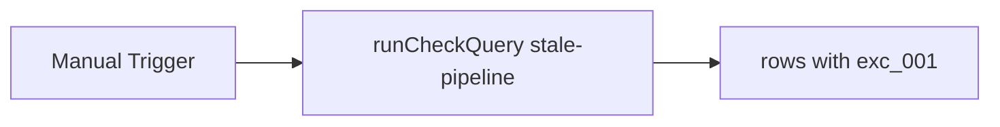

# DC Schedule Run

#n8n #workflow #daily-checks

## File

`workflows/daily-checks/dc-schedule-run.json`

## Purpose

Run stale-pipeline check query (fixture rows).

## Trigger

Manual Trigger (POC). Production would use Schedule / file watch / webhook per program.

## Flow

## Lib calls

`runCheckQuery`

## Success criteria

Output `rows` has one row with id `exc_001`.

All writes stay under `N8N_DATA_ROOT`. See [[governance/sandbox-boundaries]].

## CLI equivalent

``.\scripts\run.ps1 smoke-daily-checks``

## Related

- [[workflows/00-workflows-index]]
- [[workflows/data-flow]]
