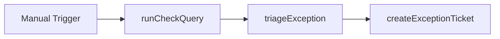

# DC Triage Exception

#n8n #workflow #daily-checks

## File

`workflows/daily-checks/dc-triage-exception.json`

## Purpose

Triage exception row and create unified ticket (sim offline).

## Trigger

Manual Trigger (POC). Production would use Schedule / file watch / webhook per program.

## Flow

## Lib calls

`triageException`, `createExceptionTicket`

## Success criteria

Output includes `triage.owner_team`, `summary`, and `ticket.ticket_ref`.

All writes stay under `N8N_DATA_ROOT`. See [[governance/sandbox-boundaries]].

## Related

- [[workflows/00-workflows-index]]
- [[workflows/data-flow]]
