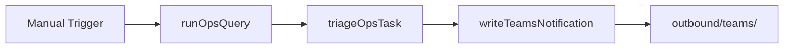

# DO Route Owners

#n8n #workflow #daily-ops

## File

`workflows/daily-ops/do-route-owners.json`

## Purpose

Route ops task to owner team and write Teams notification JSON.

## Trigger

Manual Trigger (POC). Production would use Schedule / file watch / webhook per program.

## Flow

## Lib calls

`triageOpsTask`, `writeTeamsNotification`

## Success criteria

Output `file` path exists; JSON contains `team` and `title`.

All writes stay under `N8N_DATA_ROOT`. See [[governance/sandbox-boundaries]].

## Related

- [[workflows/00-workflows-index]]
- [[workflows/data-flow]]
