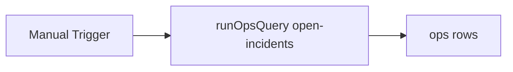

# DO Schedule Run

#n8n #workflow #daily-ops

## File

`workflows/daily-ops/do-schedule-run.json`

## Purpose

Run open-incidents ops query (fixture rows).

## Trigger

Manual Trigger (POC). Production would use Schedule / file watch / webhook per program.

## Flow

## Lib calls

`runOpsQuery`

## Success criteria

Output `rows` includes `ops_001` VPN gateway incident.

All writes stay under `N8N_DATA_ROOT`. See [[governance/sandbox-boundaries]].

## CLI equivalent

``.\scripts\run.ps1 smoke-daily-ops``

## Related

- [[workflows/00-workflows-index]]
- [[workflows/data-flow]]
