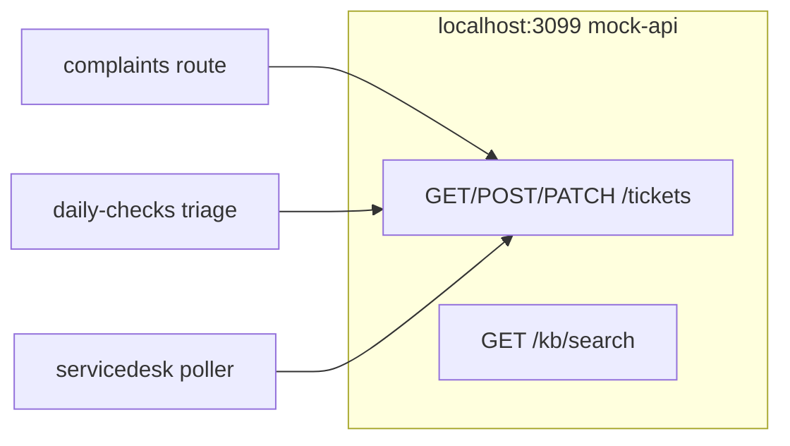
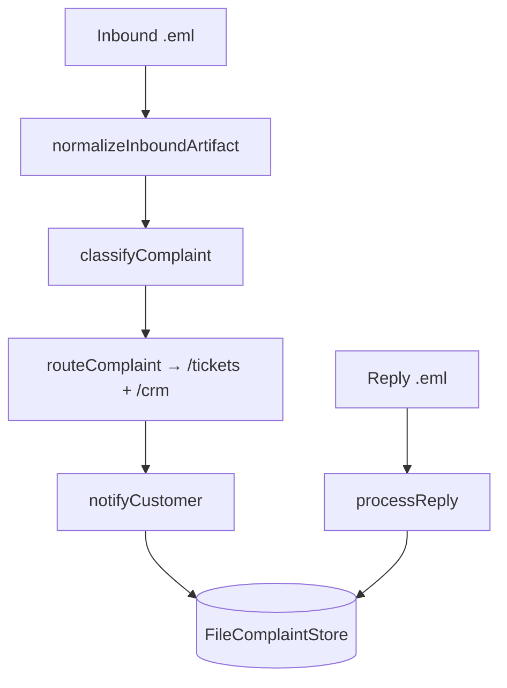
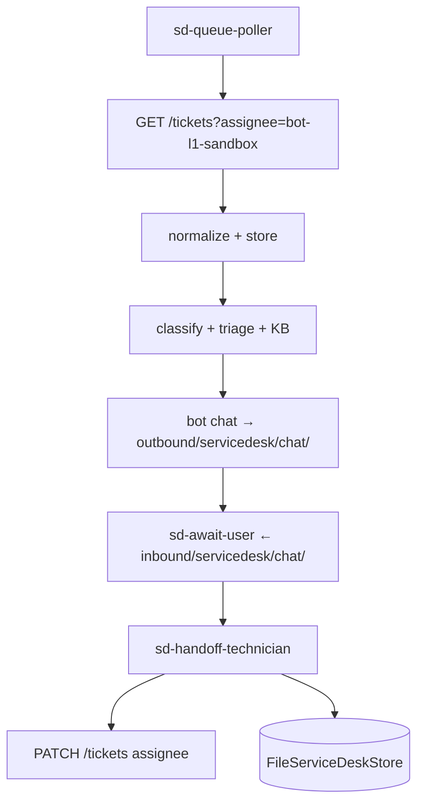
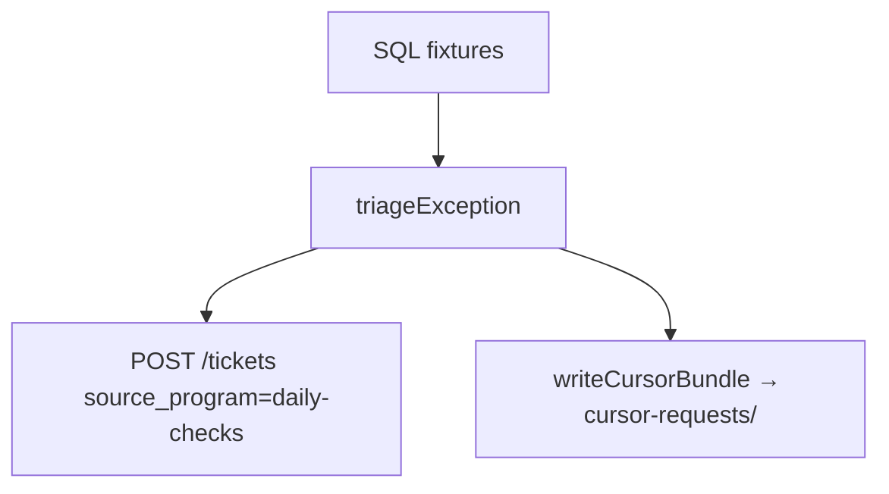
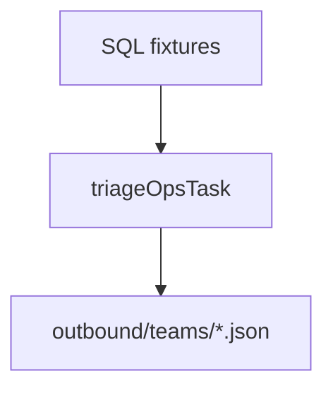

# Data flow

#n8n #workflow #mermaid

All side effects stay under `N8N_DATA_ROOT` — see [[governance/sandbox-boundaries]].

## Unified ticketing (all programs)

## Complaints classification

## Service desk (single entry point)

## Daily checks

## Daily ops

## Related

- [[workflows/00-workflows-index]]
- [[integrations/catalog]]
- [[architecture/decisions/009-unified-ticket-api]]
- [[programs/servicedesk/overview]]
