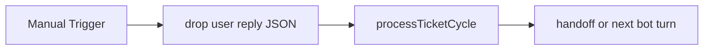

# SD Await User

#n8n #workflow #servicedesk

## File

`workflows/servicedesk/sd-await-user.json`

## Purpose

Process inbound user chat reply for awaiting_user ticket.

## Trigger

Manual Trigger (POC). Production would use Schedule / file watch / webhook per program.

## Flow

## Lib calls

`processTicketCycle` with inbound chat file

## Success criteria

User turn appended to `conversation`; may handoff if user requests human.

All writes stay under `N8N_DATA_ROOT`. See [[governance/sandbox-boundaries]].

## Related

- [[workflows/00-workflows-index]]
- [[workflows/data-flow]]
