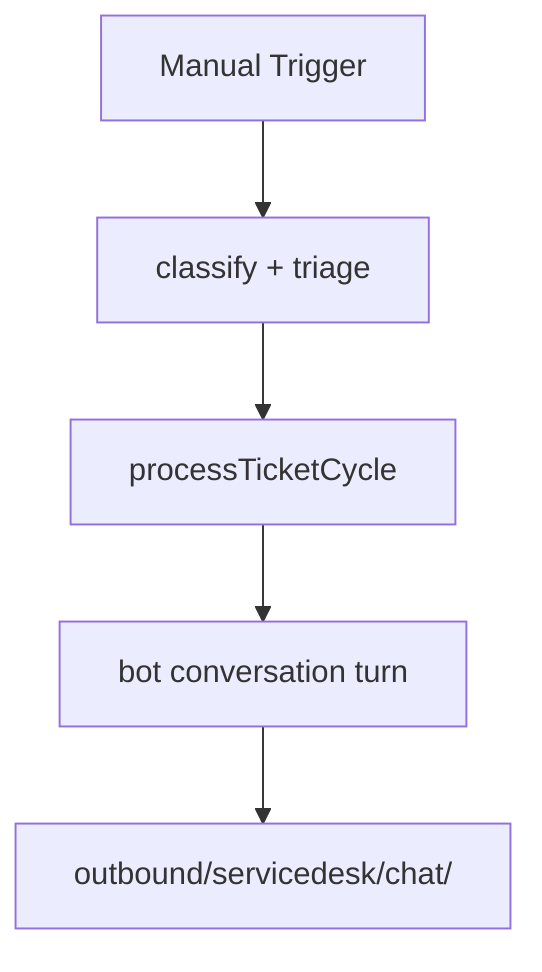

# SD Bot Reply

#n8n #workflow #servicedesk

## File

`workflows/servicedesk/sd-bot-reply.json`

## Purpose

Run one bot elicitation cycle and write chat outbound file.

## Trigger

Manual Trigger (POC). Production would use Schedule / file watch / webhook per program.

## Flow

## Lib calls

`processTicketCycle`

## Success criteria

`status` is `awaiting_user`; conversation includes bot turn; JSON chat file created.

All writes stay under `N8N_DATA_ROOT`. See [[governance/sandbox-boundaries]].

## Related

- [[workflows/00-workflows-index]]
- [[workflows/data-flow]]
