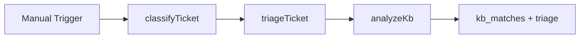

# SD Classify Triage

#n8n #workflow #servicedesk

## File

`workflows/servicedesk/sd-classify-triage.json`

## Purpose

Classify, triage, and KB-analyze a VPN ticket.

## Trigger

Manual Trigger (POC). Production would use Schedule / file watch / webhook per program.

## Flow

## Lib calls

`classifyTicket`, `triageTicket`, `analyzeKb`

## Success criteria

`status` is `in_bot_triage`; `triage.queue` set; `kb_matches` non-empty for VPN fixture.

All writes stay under `N8N_DATA_ROOT`. See [[governance/sandbox-boundaries]].

## Related

- [[workflows/00-workflows-index]]
- [[workflows/data-flow]]
