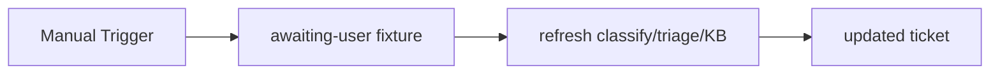

# SD Existing Ticket Refresh

#n8n #workflow #servicedesk

## File

`workflows/servicedesk/sd-existing-ticket-refresh.json`

## Purpose

Re-run classify, triage, KB on existing awaiting_user ticket.

## Trigger

Manual Trigger (POC). Production would use Schedule / file watch / webhook per program.

## Flow

## Lib calls

`classifyTicket`, `triageTicket`, `analyzeKb`

## Success criteria

KB matches refreshed; triage block populated; lifecycle includes kb_analyzed.

All writes stay under `N8N_DATA_ROOT`. See [[governance/sandbox-boundaries]].

## Related

- [[workflows/00-workflows-index]]
- [[workflows/data-flow]]
