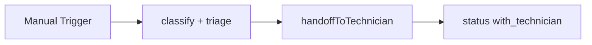

# SD Handoff Technician

#n8n #workflow #servicedesk

## File

`workflows/servicedesk/sd-handoff-technician.json`

## Purpose

Hand off ticket to human technician queue with summary.

## Trigger

Manual Trigger (POC). Production would use Schedule / file watch / webhook per program.

## Flow

## Lib calls

`handoffToTechnician`

## Success criteria

`status` is `with_technician`; `assignment.handoff_at` set; handoff lifecycle events present.

All writes stay under `N8N_DATA_ROOT`. See [[governance/sandbox-boundaries]].

## Related

- [[workflows/00-workflows-index]]
- [[workflows/data-flow]]
