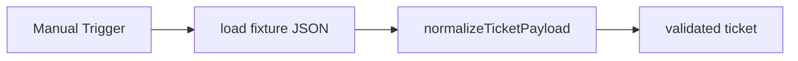

# SD Intake

#n8n #workflow #servicedesk

## File

`workflows/servicedesk/sd-intake.json`

## Purpose

Normalize vague-vpn fixture into ServiceDeskTicket schema.

## Trigger

Manual Trigger (POC). Production would use Schedule / file watch / webhook per program.

## Flow

## Lib calls

`normalizeTicketPayload`

## Success criteria

Output has `id`, `summary`, `requester`, lifecycle event `received`.

All writes stay under `N8N_DATA_ROOT`. See [[governance/sandbox-boundaries]].

## Related

- [[workflows/00-workflows-index]]
- [[workflows/data-flow]]
