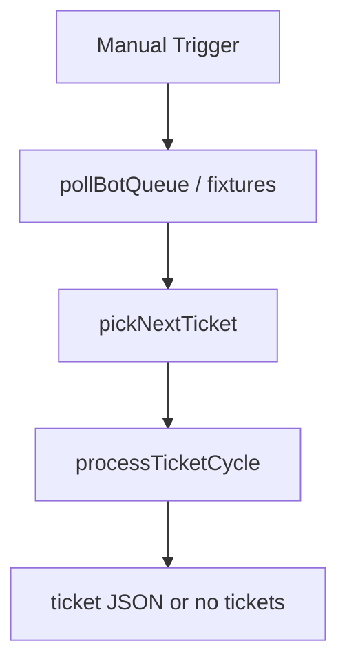

# SD Queue Poller

#n8n #workflow #servicedesk

## File

`workflows/servicedesk/sd-queue-poller.json`

## Purpose

Entry point: poll fixture queue (or API), pick priority ticket, run one bot cycle.

## Trigger

Manual Trigger (POC). Production would use Schedule / file watch / webhook per program.

## Flow

## Lib calls

`runQueuePoller`, `FileServiceDeskStore`

## Success criteria

Returns ticket with `status` awaiting_user or with_technician; `_runtime/servicedesk-db.json` updated; bot chat file in `outbound/servicedesk/chat/` when applicable.

All writes stay under `N8N_DATA_ROOT`. See [[governance/sandbox-boundaries]].

## CLI equivalent

``.\scripts\run.ps1 process-servicedesk``

## Related

- [[workflows/00-workflows-index]]
- [[workflows/data-flow]]
